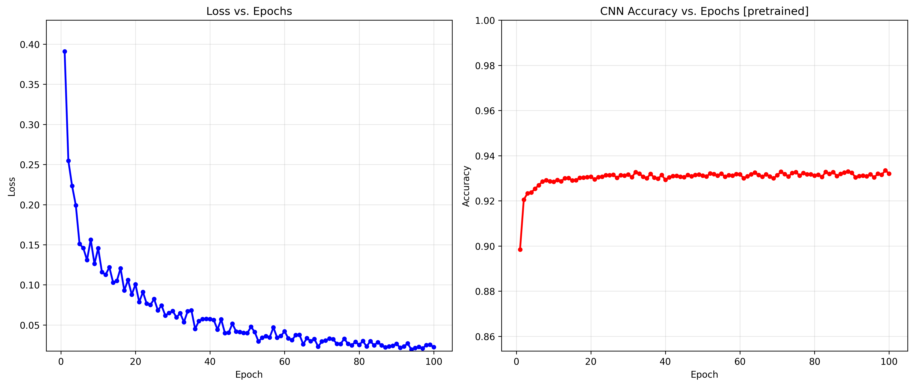
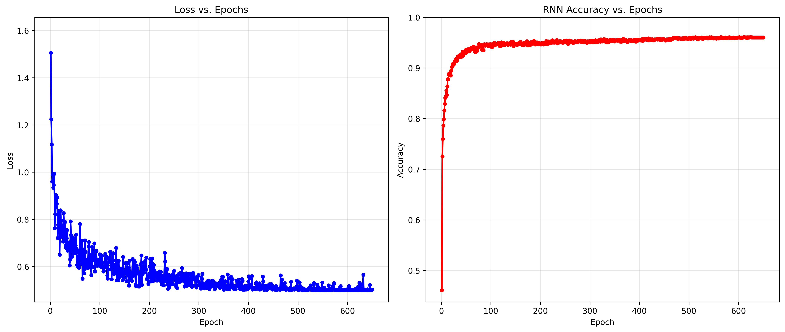
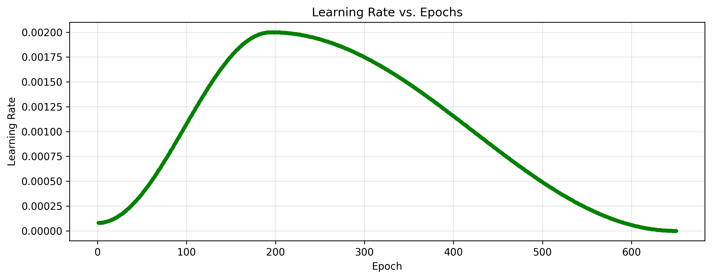

# 华中科技大学 2025春 机器学习大作业

---

## 任务二： Fashion-MNIST 数据集 调优

| Classifer                | Preprocessing                                                                                                      | Best Acc   | Macro F1 score         | Parameters |
| ------------------------ | ------------------------------------------------------------------------------------------------------------------ | ---------- | ---------------------- | ---------- |
| SVC                      | Normalization&Standardization                                                                                      | 0.8999     | 0.8998                 | ~28.8M     |
| 2-layer CNN with Dropout | RandomHorizontalFlip&VerticalFlip,Normalization&Standardization                                                    | 0.9335     | 0.9333                 | ~824K      |
| ResNet-7                 | RandomHorizontalFlip&VerticalFlip,Normalization&Standardization,Random Affine,Random Crop                          | 0.9300     | \ (Deleted before Cal) | ~184K      |
| WRN-28-2                 | RandomHorizontalFlip&VerticalFlip,Normalization&Standardization,Random Affine,Random Crop                          | 0.9564     | 0.9564                 | ~1.42M     |
| WRN-40-4                 | RandomHorizontalFlip&VerticalFlip,Normalization&Standardization,Random Affine,Random Crop                          | 0.9578     | 0.9577                 | ~8.53M     |
| SE-WRN-40-4 **[BEST]**   | RandomHorizontalFlip,Normalization&Standardization,Random Affine,Random Crop,RandomErasing,RandomApply-ColorJitter | **0.9609** | **0.9609**             | ~8.97M     |
| SE-WRN-64-8              | RandomHorizontalFlip,Normalization&Standardization,Random Affine,Random Crop,RandomErasing,RandomApply-ColorJitter | 0.9595     | 0.9595                 | ~60.9M     |

以下是2-layer CNN with Dropout 和 SE-WRN-40-4 (BEST) 的训练过程中 loss-epoch 与acc-epoch的可视化图

以下是SE-WRN-40-4的训练过程中 学习率变化 的可视化图

