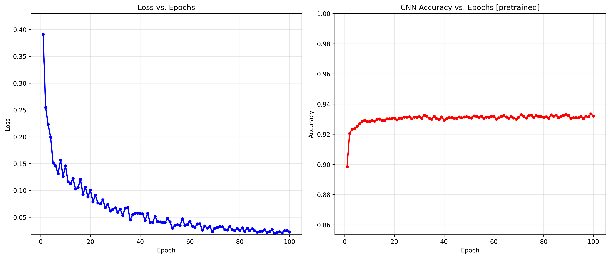
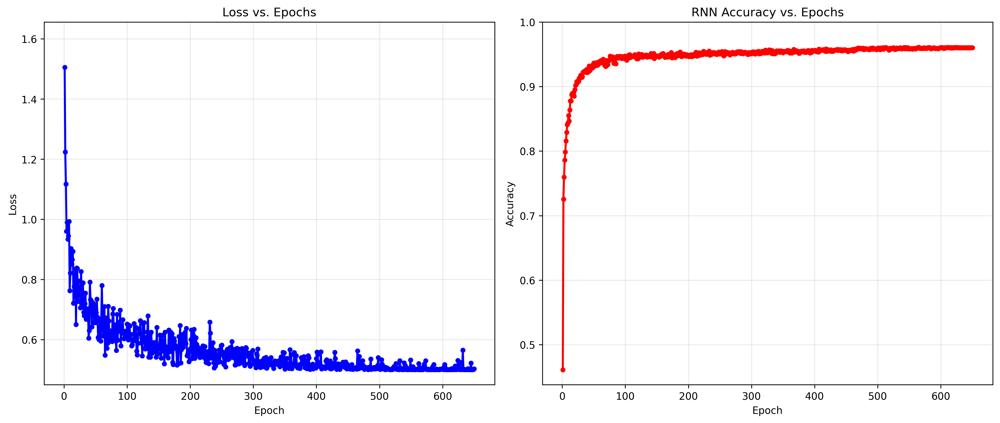

华中科技大学 2025春 机器学习大作业
====================

周宇童 2025.5.30

---

任务二： Fashion-MNIST 数据集 调优
-------------------------

## 0.关于代码(、日志和模型)

随压缩包发送的是我整理后的精简版代码。

在截止期限到之后，我会将原始代码公开在[ *https://github.com/FirmamentumX/HUST-CS-ML2025.git* ]

## 1. 问题定义与理解

### 1.1 任务目标

本次机器学习的大作业任务二旨在构建图像分类模型，对Fashion-MNIST数据集中的各种服饰进行自动识别。需实现将28×28灰度图像正确分类到10个时尚类别（T恤、裤子、套头衫、连衣裙等）的任务。

### 1.2 数据集特性

| 属性   | 描述                                                                    |
| ---- | --------------------------------------------------------------------- |
| 来源   | Zalando公司图像数据集 [https://github.com/zalandoresearch/fashion-mnist.git] |
| 规模   | 70,000张 (60k训练+10k测试)                                                 |
| 图像格式 | 单通道灰度图 (28×28像素)                                                      |
| 像素范围 | [0,255]  (int_8)                                                      |
| 类别数  | 10类服饰（每类均衡分布）                                                         |

> **与经典MNIST对比**：虽然同样为28×28图像，但Fashion-MNIST包含纹理特征更复杂的服饰类图像，类别间视觉差异更细微，更适合评估实际场景下的分类性能。正如github仓库上的README所言:
> 
>     **MNIST is too easy.** 
> 
>     **MNIST is overused.** 
> 
>     **MNIST can not represent modern CV tasks**

### 1.3 方法选择依据

接下来我会选择三条基础的技术路线，**SVM**，**CNN** 和**RNN**，以进行由浅及深、由表及里的探索

[1] 选择SVM的原因:

    1.实现简单，几乎只用调库，甚至不需要优化技巧

    2.支持经典，使用核技巧在高维空间中用支持向量机进行切分，理论上来说效果应该较好

[2] 选择CNN的原因：

    1.模型结构较简单，主要只需要叠2~3层卷积层，加点池化和Dropout即可

    2.可以使用炼丹技巧进行优化

[3] 选择RNN的原因：

    1.学习能力强，残差网络允许叠出更深层的网络

    2.优化空间大，可以加很多神奇的东西

总之由SVM负责试水，RNN负责最终扛大旗。

---

## 2. 数据分析及处理

### 2.1 数据统计特征

#### 2.1.1 是否均衡分布

```python
import torch
from torchvision import datasets, transforms

# 加载训练集
train_dataset = datasets.FashionMNIST(
    root='./data',
    train=True,
    transform=transforms.ToTensor(),
    download=True
)

# 获取所有标签并统计类别分布
labels = train_dataset.targets
class_counts = labels.bincount()
print("类别分布：", class_counts.tolist())

# 判断是否类别均衡（每个类别是否都有6000个样本）
is_balanced = all(count == 6000 for count in class_counts)
print("是否类别均衡：", is_balanced)
```


输出结果：

    *类别分布： [6000, 6000, 6000, 6000, 6000, 6000, 6000, 6000, 6000, 6000]
    是否类别均衡： True*

说明：Fashion-MNIST的类别满足均衡分布


#### 2.1.2  计算全局均值与标准差

*备注：我在做到RNN时才注意到这点，之前都直接用的两个0.5*


```python
import torch
from torchvision import datasets, transforms

# 加载训练集
train_dataset = datasets.FashionMNIST(
    root='./data',
    train=True,
    transform=transforms.ToTensor(),
    download=True
)

# 加载数据并计算全局均值和标准差
loader = torch.utils.data.DataLoader(train_dataset, batch_size=1000)

total_pixels = 0
sum_pixels = 0.0
sum_sq_pixels = 0.0

for images, _ in loader:
    # 展平为一维向量，形状为 [batch_size * 1 * 28 * 28]
    batch_pixels = images.view(-1)
    total_pixels += batch_pixels.numel()
    sum_pixels += batch_pixels.sum().item()
    sum_sq_pixels += (batch_pixels ** 2).sum().item()

# 计算均值和标准差
mean = sum_pixels / total_pixels
std = (sum_sq_pixels / total_pixels - mean ** 2) ** 0.5
```


输出结果：

    数据集均值：0.2860
    数据集标准差：0.3530

说明：标准化时要加上这两个常数，不要直接用两个0.5

```python
from torchvision import datasets, transforms

transform = transforms.Compose([
    transforms.ToTensor(),
    transforms.Normalize((0.2860,), (0.3530,))
])
```


### 2.2 数据集可视化


图像特征分析：

* 存在类内差异（鞋子类别包含运动鞋与皮鞋乃至轮滑鞋）
* 类间相似性较高（衬衫与外套乃至套头衫轮廓都很接近）
* 背景干扰较小（均为纯黑色背景）
  
  

### 2.3 预处理流程

#### 2.3.1 标准化处理（Normalization & Standardization）

| 名称  | 操作       | 数学表达      | torch.transforms      | 效果     |
| --- | -------- | --------- | --------------------- | ------ |
| 归一化 | 缩放到[0,1] | `X/255`   | ToTensor()            | 统一像素量纲 |
| 标准化 | Z-score  | `(X-μ)/σ` | Normalize((μ,), (σ,)) | 处理亮度不均 |

#### 2.3.2 数据增强 (Data Augmentation)

| 名称       | torch.transforms                      | 操作                 | 效果    | 备注         |
| -------- | ------------------------------------- | ------------------ | ----- | ---------- |
| 随机水平翻转   | RandomHorizontalFlip(p)               | p概率对图做水平翻转         | ★     |            |
| 随机竖直翻转   | RandomVerticalFlip(p)                 | p概率对图做竖直翻转         | ×     | 破坏服饰特征，不推荐 |
| 随机裁剪     | RandomCrop(size,padding)              | 50%概率做带扩充的随机裁剪     | ★★    |            |
| 随机仿射变换   | RandomAffine(degrees, translate, ...) | 50%概率做仿射变换         | ★★⯨   | 真换视角可能会带黑边 |
| 随机(图像增强) | RandomApply([ColorJitter(min, max)])  | 50%概率做亮度、对比度的20%浮动 | ★★★   |            |
| 随机Cutout | RandomErasing(p,scale )               | p概率做scale范围像素随机值化  | ★★★★★ | 唯一真神       |


## 3. 模型构建

### 3.1  支持向量机 (SVM)

#### 3.1.1 标准化SVM

在完成标准化处理后，直接调用scikit-learn中的SVM进行训练。

- 核函数：RBF核
- 正则化参数：C=10
- 核函数参数：gamma=0.01
- 优化目标：最大化分类间隔

```python
from sklearn.preprocessing import StandardScaler
from sklearn import svm
from sklearn.metrics import accuracy_score, f1_score
from torchvision import datasets, transforms
import joblib

# 加载数据
transform = transforms.ToTensor()
train_set = datasets.FashionMNIST(root='./data', train=True, download=True, transform=transform)
test_set = datasets.FashionMNIST(root='./data', train=False, download=True, transform=transform)

# 转换为numpy数组并展平，进行像素归一化
X_train = train_set.data.numpy().reshape(60000, -1) / 255.0
y_train = train_set.targets.numpy()
X_test = test_set.data.numpy().reshape(10000, -1) / 255.0
y_test = test_set.targets.numpy()

# 进行标准(正态分布)化
scaler = StandardScaler()
X_train_scaled = scaler.fit_transform(X_train)
X_test_scaled = scaler.transform(X_test)

# 训练
clf = svm.SVC(kernel='rbf', C=10, gamma=0.01, verbose=True)
clf.fit(X_train_scaled, y_train)

# 评估
pred = clf.predict(X_test_scaled)
print(f"SVM Accuracy: {accuracy_score(y_test, pred):.4f}, F1 Score: {f1_score(y_test, pred, average='macro'):.4f}")

# 保存模型
joblib.dump(clf, './models/scaler_svm.pkl')
# [LibSVM]SVM Accuracy: 0.8999, F1 Score: 0.8998
```


最终结果： 准确率为0.8999， F1 Score为0.8998

评价： *属于那种你只能眼睁睁地看着跑低分的那种*


### 3.1.2 HOG-enhanced SVM

既然SVM的能力显得如此薄弱，自当想办法强化图像中的特征。方向梯度直方图（Histogram of Oriented Gradient, HOG）特征是一个较好的选择


**什么是HOG?** 

这是一个简单的例子：


统共做这几步：

- 用Sobel算子 (或者Canny或者什么别的) 提取边缘梯度

- 按小单元切分原图，小单元内统计梯度直方图

- 小单元以滑动窗口形式构建块，块内归一化

- 计算HOG特征向量

好处？

    理论上来说，这样基于图像的梯度信息统计，可以有效提取图像局部特征。

    理论上来说，HOG特征提取能够生成具有旋转不变性和一定鲁棒性的特征向量。

代码实现？

    只要加上这几步即可

```python
# 将图像恢复为28x28格式
X_train_2d = X_train_scaled.reshape(-1, 28, 28)
X_test_2d = X_test_scaled.reshape(-1, 28, 28)

# 提取 HOG 特征
X_train_hog = [hog(img, pixels_per_cell=(4, 4), cells_per_block=(2, 2)) for img in X_train_2d]
X_test_hog = [hog(img, pixels_per_cell=(4, 4), cells_per_block=(2, 2)) for img in X_test_2d]

```

实际结果？

    准确率下降到了0.8940。效果变差了。

*备注：如果真的效果好的话我就会把这个放到2.3预处理中了*


为什么？

    HOG特征提取本质上就是一种“增强”后的边缘提取。

    **那我问你：把衬衫和外套的边缘提取出来，有利于识别吗？**

    结果反而折损了其他的信息。

    这启示我们：只有**边缘明显，影响显著**的情况，比如行人识别、表情识别的场景下，HOG特征提取才适用！


### 3.1.3 Grid-Search for SVM

很好——现在不能从特征下手增强SVM了，SVM本体也不好改结构增强，现在只剩一条路了：调参

为此，我准备了如以下所示的**网格搜索**，势必要找到最合适的参数


```python
# 网格搜索最优化超参数
param_grid = {
    'C': [0.1, 1, 10, 100],
    'gamma': [0.001, 0.01, 0.1, 1],
    'kernel': ['rbf', 'poly']
}

grid_search = GridSearchCV(svm.SVC(), param_grid, cv=5, scoring='accuracy', n_jobs=-1)
grid_search.fit(X_train_scaled, y_train)

# 使用最优参数训练最终模型
best_params = grid_search.best_params_
final_model = svm.SVC(**best_params)
final_model.fit(X_train_scaled, y_train)
```


看上去，似乎很正确？至少跑起来没报错...


                                                                          **32核CPU跑满的盛况**


scikit-learn包中实现的模型是基于CPU而非GPU在跑的。

这个网格搜索需完成5折交叉验证×(4×4×2)=160次训练，在32核CPU上跑满超过3小时未出结果。


### 3.2 卷积神经网络 (CNN)

### 3.2.1 双卷积层 CNN

模型的实现如下：

```python
# 模型定义
class CNN(nn.Module):
    def __init__(self):
        super().__init__()
        self.net = nn.Sequential(
            nn.Conv2d(1, 32, 3, padding=1), nn.ReLU(), nn.MaxPool2d(2),
            nn.Conv2d(32, 64, 3, padding=1), nn.ReLU(), nn.MaxPool2d(2),
            nn.Flatten(),
            nn.Linear(64*7*7, 128), nn.ReLU(),
            nn.Linear(128, 10)
        )

    def forward(self, x):
        return self.net(x)
```

这是一个经典的CNN实现，2Conv + 2 FC + Pooling，激活函数也是经典款ReLU。

具体来讲，卷积层提取局部特征，ReLU引入非线性，池化降维并增强平移不变性，全连接层组合特征做最终分类。


简单测试的结果： 准确率为 0.9180


### 3.2.2 双卷积层 CNN + Dropout

Dropout:防止过拟合必备手段

具体就是在之前实现中，最后的全连接层处添加1次Dropout。

然后将已训练好的模型做反复迭代训练

添加余弦调度器用于操控“火候”。


测试结果： 准确率为0.9335，F1 分数为0.9333

最好一次的训练可视化：




### 3.3 残差神经网络 (RNN)

终于到这一步了，终于要开始放手一搏，冲击最高准确率，而非走马观花了。

#### 3.3.1 ResNet-7

    先实现一个简单的残差网络，为之后优化做准备。

```python
# 残差块定义
class ResidualBlock(nn.Module):
    def __init__(self, channels):
        super(ResidualBlock, self).__init__()
        self.conv1 = nn.Conv2d(channels, channels, kernel_size=3, padding=1)
        self.bn1 = nn.BatchNorm2d(channels)
        self.conv2 = nn.Conv2d(channels, channels, kernel_size=3, padding=1)
        self.bn2 = nn.BatchNorm2d(channels)

    def forward(self, x):
        residual = x
        x = torch.relu(self.bn1(self.conv1(x)))
        x = self.bn2(self.conv2(x))
        x += residual
        return torch.relu(x)

# 残差网络
class ResNet(nn.Module):
    def __init__(self):
        super(ResNet, self).__init__()
        self.net = nn.Sequential(
            nn.Conv2d(1, 64, kernel_size=3, padding=1),
            ResidualBlock(64),
            nn.MaxPool2d(2),
            nn.Conv2d(64, 64, kernel_size=3, padding=1),
            ResidualBlock(64),
            nn.AdaptiveAvgPool2d((1,1)),
            nn.Flatten(),
            nn.Linear(64, 10)
        )

    def forward(self, x):
        return self.net(x)
```

残差网络的核心原理在于为`CNN`引入`shortcut`连接，从而使得卷积块不是简单的堆叠。残差块在前向传播时，会将传播后的结果加上原结果，从而达成恒等映射，可以有效防止梯度爆炸。


简单测试结果： 准确率为0.9300


#### 3.3.2  WideResNet

为什么我不选择去堆叠更深层的残差网络呢(比如经典版ResNet-18)，而是选择WideResNet呢？

~~因为FashionMNIST的github仓库上显示WRN-40-4最高~~


模型实现如下：

```python

class IResidualBlock(nn.Module):
    def __init__(self, in_channels, out_channels, stride=1, dropout_rate=0.0):
        super(IResidualBlock, self).__init__()
        self.conv1 = nn.Conv2d(in_channels, out_channels, kernel_size=3, stride=stride, padding=1, bias=False)
        self.bn1 = nn.BatchNorm2d(out_channels)
        self.dropout1 = nn.Dropout(dropout_rate)
        self.conv2 = nn.Conv2d(out_channels, out_channels, kernel_size=3, stride=1, padding=1, bias=False)
        self.bn2 = nn.BatchNorm2d(out_channels)
        self.dropout2 = nn.Dropout(dropout_rate)

        # Shortcut connection
        self.shortcut = nn.Sequential()
        if stride != 1 or in_channels != out_channels:
            self.shortcut = nn.Sequential(
                nn.Conv2d(in_channels, out_channels, kernel_size=1, stride=stride, bias=False),
                nn.BatchNorm2d(out_channels)
            )

    def forward(self, x):
        out = F.relu(self.bn1(self.conv1(x)))
        out = self.dropout1(out)
        out = self.bn2(self.conv2(out))
        out = self.dropout2(out)
        out += self.shortcut(x)
        return F.relu(out)

# WRN-40-4 模型
class WideResNet(nn.Module):
    def __init__(self, depth=40, widen_factor=4, num_classes=10, dropout_rate=0.3):
        super(WideResNet, self).__init__()
        assert (depth - 4) % 6 == 0, 'Depth should be 6n + 4'
        n = (depth - 4) // 6  # 每个 stage 的 block 数量为 6

        # 初始卷积层
        self.net = nn.Sequential(
            nn.Conv2d(1, 16, kernel_size=3, padding=1, bias=False),
            nn.BatchNorm2d(16),
            nn.ReLU()
        )

        # 三阶段构建，每个阶段通道数都更多（变宽）
        self._make_stage(16, 16 * widen_factor, n, stride=1, dropout_rate=dropout_rate)
        self._make_stage(16 * widen_factor, 32 * widen_factor, n, stride=2, dropout_rate=dropout_rate)
        self._make_stage(32 * widen_factor, 64 * widen_factor, n, stride=2, dropout_rate=dropout_rate)

        # 添加最终分类层
        self.net.append(nn.AdaptiveAvgPool2d((1, 1)))
        self.net.append(nn.Flatten())
        self.net.append(nn.Linear(64 * widen_factor, num_classes))

    def _make_stage(self, in_channels, out_channels, num_blocks, stride, dropout_rate):
        self.net.append(IResidualBlock(in_channels, out_channels, stride=stride, dropout_rate=dropout_rate))
        for _ in range(1, num_blocks):
            self.net.append(IResidualBlock(out_channels, out_channels, dropout_rate=dropout_rate))

    def forward(self, x):
        return self.net(x)

```

在WRN的模型定义中，统共被分为三个阶段的构建，后一阶段的层接续前一阶段的层，并乘上一个因子进行变宽操作。

特别的，对于WRN-40-4而言，三阶段每个阶段有6个Block，阶段开始前有1层 卷积层，每个阶段的第一个Block 存在Shortcut，有3个卷积层，第2~6个Block无Shortcut，各有2个卷积层，即每阶段有13个卷积层，总共1+13 * 3 = 40层


每一个Block的实质就是残差块，不过比起之前实现的残差块，这里实现的多加了Dropout。


经过我的反复调试后，WRN-28-2 最高取得 ：准确率 0.9564, F1 0.9564;

    WRN-40-4 最高取得： 准确率0.9578, F1 0.9577


### 3.3.3 SE-WRN

现在开始最终优化： 开启“黑魔法”更上一层楼，让WRN更加伟大。


3.3.3.1 注意力机制优化 **[Squeeze-and-Excitation Block]**

SE Block 是一种**通道注意力机制** ，旨在通过显式建模卷积特征图的通道间关系，增强重要通道的特征表达，抑制不重要的通道。其核心思想是：

* **Squeeze（压缩）** ：通过全局池化将空间维度压缩为全局特征向量。
  具体实现：输入为 `[B, C, H, W]`   (Batch, Channel, Height, Width)
  对每个通道进行全局平均池化（AdaptiveAvgPool2d(1)），
  将每个通道的H×W个值压缩为1个值，得到形状为 `[B, C, 1, 1]`    

* **Excitation（激励）** ：通过全连接网络学习通道间的依赖关系，生成通道权重。
  具体实现：输入为`[B, C, 1, 1]`

        先展平，变为 `[B, C]`

        引入第一个全连接层，先**压缩**参数量，压缩倍数默认为16，得到`[B, C//16]`

        用ReLU激活，引入非线性因素。

        然后是第二个全连接层，进行**升维**，恢复原始通道数，得到`[B, C]`

        用Sigmoid激活，归一化到[0, 1]，表征每个通道的重要性，得到**权重**

* **Re-calibration（重校准）** ：将权重应用到原始特征图，调整各通道的响应强度。
  
  具体实现，前向传播时，将原始输入逐通道地乘上权重。如此，重要通道的特征被增强，不重要通道的特征被抑制。
  
  
  
  

代码实现：

```python
class SEBlock(nn.Module):
    def __init__(self, channels, reduction=16):
        super(SEBlock, self).__init__()
        self.avg_pool = nn.AdaptiveAvgPool2d(1)
        self.fc1 = nn.Linear(channels, channels // reduction)
        self.fc2 = nn.Linear(channels // reduction, channels)

    def forward(self, x):
        b, c, _, _ = x.size()
        y = self.avg_pool(x).view(b, c)
        y = F.relu(self.fc1(y))
        y = torch.sigmoid(self.fc2(y)).view(b, c, 1, 1)
        return x * y.expand_as(x)

```

 SE-Block 可以无缝嵌入现有网络，比如可以直接放在卷积层之后。


3.3.3.2 残差块预激活 [**Pre-Activate**]

在ResNetV2论文 Identity Mappings in Deep Residual Networks 中就提出，预激活结构（BN → ReLU → Conv）相比后激活结构（Conv → BN → ReLU）可以更缓解梯度消失问题，提升深层网络的训练稳定性，因为预激活保留了更多原始特征。

结合上一小节的SE Block，可以构建 SE-PreAct的残差块如下：

```python
class SEPreActBlock(nn.Module):
    def __init__(self, in_channels, out_channels, stride=1, dropout_rate=0.0):
        super(SEPreActBlock, self).__init__()
        # print(f"SEPreActBlock: in_channels={in_channels}, out_channels={out_channels}")
        self.bn1 = nn.BatchNorm2d(in_channels)
        self.conv1 = nn.Conv2d(in_channels, out_channels, kernel_size=3, stride=stride, padding=1, bias=False)
        self.bn2 = nn.BatchNorm2d(out_channels)
        self.conv2 = nn.Conv2d(out_channels, out_channels, kernel_size=3, stride=1, padding=1, bias=False)
        self.dropout = nn.Dropout(dropout_rate)
        self.se = SEBlock(out_channels)

        # Shortcut
        self.shortcut = nn.Sequential()
        if stride != 1 or in_channels != out_channels:
            self.shortcut = nn.Sequential(
                nn.Conv2d(in_channels, out_channels, kernel_size=1, stride=stride, bias=False),
                nn.BatchNorm2d(out_channels)
            )

    def forward(self, x):
        out = F.relu(self.bn1(x))
        out = self.conv1(out)
        out = F.relu(self.bn2(out))
        out = self.dropout(out)
        out = self.conv2(out)
        out = self.se(out)
        out += self.shortcut(x)
        return out
```


3.3.3.3  随机深度 [**Stochastic Depth**]

训练时随机跳过某些残差块不管，这样做和Dropout有异曲同工之妙。

Stochastic Depth 包裹器的代码实现很简单，就训练的前向传播时概率跳过即可：

```python
class StochasticBlock(nn.Module):
    def __init__(self, block, survival_prob=0.8):
        super(StochasticBlock, self).__init__()
        self.block = block
        self.survival_prob = survival_prob

    def forward(self, x):
        if self.training and torch.rand(1).item() > self.survival_prob:
            return x  # 跳过该块
        return self.block(x)

```

温馨提示：建议恒等映射时才使用Stochastic Depth 包裹器，否则模型结构会崩坏


3.3.3.4 **OneCycleLR** ：融合了余弦退火和初始WARMUP的最强调度器

温馨提示：最大学习率不宜太高，否则该炸还是会爆炸的


3.3.3.5 **CutOut**: 最强的数据增强

可见于2.3节


3.3.3.6 Label_smoothing : 标签平滑


将hard label转变成soft label，使网络优化更加平滑。


3.3.3.7 集合第1，2，3小节的加强版WRN

代码实现如下，其实就是替换了极少部分内容：

```python
class EnhancedWideResNet(nn.Module):
    def __init__(self, depth=64, widen_factor=8, num_classes=10, dropout_rate=0.3, survival_prob=0.8):
        super(EnhancedWideResNet, self).__init__()
        assert (depth - 4) % 6 == 0, 'Depth should be 6n + 4'
        n = (depth - 4) // 6  # 每个 stage 的 block 数量

        # 初始卷积层
        self.net = nn.Sequential(
            nn.Conv2d(1, 16, kernel_size=3, padding=1, bias=False),
            nn.BatchNorm2d(16),
            nn.ReLU()
        )

        # 三阶段构建（使用 SEPreActBlock + Stochastic Depth）
        self._make_stage(16, 16 * widen_factor, n, stride=1, dropout_rate=dropout_rate, survival_prob=survival_prob)
        self._make_stage(16 * widen_factor, 32 * widen_factor, n, stride=2, dropout_rate=dropout_rate, survival_prob=survival_prob)
        self._make_stage(32 * widen_factor, 64 * widen_factor, n, stride=2, dropout_rate=dropout_rate, survival_prob=survival_prob)

        # 分类头
        self.net.append(nn.AdaptiveAvgPool2d((1, 1)))
        self.net.append(nn.Flatten())
        self.net.append(nn.Linear(64 * widen_factor, num_classes))

    def _make_stage(self, in_channels, out_channels, num_blocks, stride, dropout_rate, survival_prob):
        # 第一个 block 有 stride
        block = SEPreActBlock(in_channels, out_channels, stride=stride, dropout_rate=dropout_rate)
        self.net.append(block) # 这个块要改变通道数，不能用StochasticBlock跳过，否则爆炸
        # 后续 blocks 无 stride
        for _ in range(1, num_blocks):
            block = SEPreActBlock(out_channels, out_channels, dropout_rate=dropout_rate)
            self.net.append(StochasticBlock(block, survival_prob=survival_prob))

    def forward(self, x):
        return self.net(x)
```


最终结果：

SE-WRN-40-4 取得最好准确率：

# 0.9609

以下是SE-WRN-40-4 [BEST] 的训练过程可视化。



## 4. 实验的最终结果一览

| Classifer                | Preprocessing                                                                                                      | Best Acc   | Macro F1 score         | Parameters |
| ------------------------ | ------------------------------------------------------------------------------------------------------------------ | ---------- | ---------------------- | ---------- |
| SVC                      | Normalization&Standardization                                                                                      | 0.8999     | 0.8998                 | ~28.8M     |
| 2-layer CNN with Dropout | RandomHorizontalFlip&VerticalFlip,Normalization&Standardization                                                    | 0.9335     | 0.9333                 | ~824K      |
| ResNet-7                 | RandomHorizontalFlip&VerticalFlip,Normalization&Standardization,Random Affine,Random Crop                          | 0.9300     | \ (Deleted before Cal) | ~184K      |
| WRN-28-2                 | RandomHorizontalFlip&VerticalFlip,Normalization&Standardization,Random Affine,Random Crop                          | 0.9564     | 0.9564                 | ~1.42M     |
| WRN-40-4                 | RandomHorizontalFlip&VerticalFlip,Normalization&Standardization,Random Affine,Random Crop                          | 0.9578     | 0.9577                 | ~8.53M     |
| SE-WRN-40-4 **[BEST]**   | RandomHorizontalFlip,Normalization&Standardization,Random Affine,Random Crop,RandomErasing,RandomApply-ColorJitter | **0.9609** | **0.9609**             | ~8.97M     |
| SE-WRN-64-8              | RandomHorizontalFlip,Normalization&Standardization,Random Affine,Random Crop,RandomErasing,RandomApply-ColorJitter | 0.9595     | 0.9595                 | ~60.9M     |


分析：不要以为Fashion-MNIST同MNIST类似都是28x28就显得很简单，一般的模型都很难跑出高分。

各种加强后的WideResNet最终还是取得了一个较好的结果。


## 5. 分析、结论与改进方向

### 5.1 分析与结论

模型性能对比：

| 模型类型                   | 最佳准确率  | 参数量    | 核心总结                    |
| ---------------------- | ------ | ------ | ----------------------- |
| **SVC**                | 89.99% | ~28.8M | 简单而不高效，适合小规模数据          |
| **2-layer CNN**        | 93.35% | ~824K  | 基础卷积特征提取，又小又强           |
| **ResNet-7**           | 93.00% | ~184K  | 残差结构缓解梯度消失，奈何层数太少难以发挥作用 |
| **WRN-28-2**           | 95.64% | ~1.42M | 宽残差结构增强特征表达，总之就是强       |
| **WRN-40-4**           | 95.78% | ~8.53M | 更深网络更加提升拟合能力            |
| **SE-WRN-40-4 [BEST]** | 96.09% | ~8.97M | 注意力机制优化特征权重，突破准确率瓶颈     |
| **SE-WRN-64-8**        | 95.95% | ~60.9M | 超参数调整后的次优方案，参数太多也未必好    |

>  **结论**：
> 
> - **深度学习碾压传统方法**：SVM虽经标准化处理，但拼尽全力无法战胜CNN，准确率大幅落后CNN超6个百分点
> - **数据增强至关重要**：随机翻转/裁剪...尤其是CutOut，这些增强手段有效地给模型上了强度，提高了泛化能力
> - **注意力机制突破瓶颈**：SE模块使WRN-40-4超越普通WRN-40-4达0.31%
> - **参数效率悖论**：最优模型SE-WRN-40-4参数量仅8.97M，远低于SVM的28.8M。这说明，参数不是越多越好，小心练成了“死肌肉”


### 5.2 未来改进方向

#### 5.2.1 对SVM的优化

[1] 特征工程强化

```python
multi_scale_hog = [ hog(img, pixels_per_cell=(2,2), ...), hog(img, pixels_per_cell=(4,4), ...), hog(img, pixels_per_cell=(8,8), ...)]
```

单尺度的HOG特征不可行，那能否引入多尺度的呢？


[2] 核函数创新

```python
#  使用自定义复合核函数
def hybrid_kernel(X, Y):
    return rbf_kernel(X, Y) + polynomial_kernel(X, Y, degree=2)
```

能否使用自定义的复合核函数，更好地进行高维可分空间的映射呢？


#### 5.2.2 对于深度学习模型的优化

[1] ResNeXt 多分支残差结构+ Shake-Shake 正则化

```python
class ShakeShakeBlock(nn.Module):
    def __init__(self, in_channels, out_channels, stride=1):
        super().__init__()
        self.branch1 = self._make_branch(in_channels, out_channels, stride)
        self.branch2 = self._make_branch(in_channels, out_channels, stride)

    def forward(self, x):
        alpha = torch.rand(1).to(x.device)
        out = alpha * self.branch1(x) + (1 - alpha) * self.branch2(x)
        return out
```

引入多分支的残差结构，并使用随机权重混合，能否更进一步？


[2] 集成学习策略（Ensemble Learning）

集合多个模型进行Bagging ，投票得结果，能否更进一步？


#### 5.2.3 错误分析与可视化

[1] 混淆矩阵分析

* 找出易混淆类别，针对性优化。

```python
from sklearn.metrics import confusion_matrix
import seaborn as sns

cm = confusion_matrix(y_true, y_pred)
sns.heatmap(cm, annot=True, fmt='d')
```


[2] Grad-CAM 可视化

* 查看模型关注区域，判断是否关注了正确特征。

```python
from pytorch_grad_cam import GradCAM

cam = GradCAM(model=model, target_layers=[model.layer4[-1]])
```


